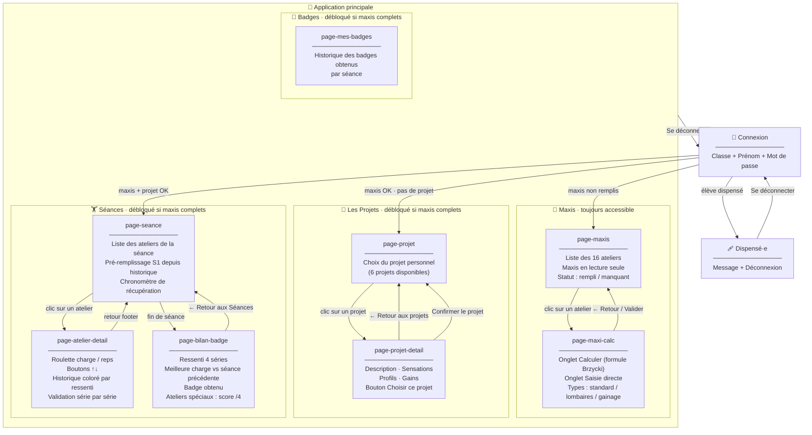

# Sitemap — Muscu à J2B

## Diagramme de navigation



## Règles de déverrouillage

| Page | Condition d'accès |
|------|-------------------|
| 💪 Maxis | Toujours accessible après connexion |
| 🎯 Les Projets | Tous les maxis renseignés |
| 🏋️ Séances | Tous les maxis renseignés |
| 🏅 Badges | Tous les maxis renseignés |

## Logique de redirection à la connexion (`showPageAfterLogin`)

```
Connexion réussie
    ↓
Élève dispensé ?  →  screen-dispensed
    ↓ non
Maxis non remplis ?  →  page-maxis
    ↓ non
Projet non choisi ?  →  page-projet
    ↓ non
→  page-seance
```

## Pages sans bouton footer direct

| Page | Accès depuis |
|------|-------------|
| `page-maxi-calc` | Clic sur atelier dans page-maxis |
| `page-projet-detail` | Clic sur un projet dans page-projet |
| `page-atelier-detail` | Clic sur atelier dans page-seance |
| `page-bilan-badge` | Fin de séance (validation dernier atelier) |
